# Architektura Projektu FishCards

## Struktura Komponentów i Zależności

```mermaid
---
id: 785637bc-7d48-41c4-b326-115a4d43301e
---
graph TB
    %% === WARSTWY ARCHITEKTURY ===
    
    subgraph "🌐 CLIENT LAYER"
        subgraph "📄 Astro Pages"
            HomePage["index.astro"]
            DashboardPage["dashboard.astro"]
            GeneratorPage["generator.astro"]
            FlashcardsPage["flashcards.astro"]
            AuthPages["auth pages"]
        end
        
        subgraph "🎛️ Layout System"
            Layout["Layout.astro"]
            HeaderComp["HeaderComponent.tsx"]
        end
    end

    subgraph "⚛️ REACT COMPONENTS LAYER"
        subgraph "🔐 Auth Module"
            AuthGuard[AuthGuard]
            LoginForm[LoginForm]
            RegisterForm[RegisterForm]
        end
        
        subgraph "📊 Dashboard Module"
            DashboardView[DashboardView]
            StatsOverview[StatsOverview] 
            QuickActions[QuickActionButtons]
        end
        
        subgraph "🤖 Generator Module"
            GeneratorView[GeneratorView]
            TextInput[TextInputSection]
            ProposalsSection[ProposalsSection]
            LoadingOverlay[LoadingOverlay]
        end
        
        subgraph "📚 Flashcards Module"
            FlashcardsView[FlashcardsView]
            FlashcardsTable[FlashcardsTable]
            CreateModal[CreateFlashcardModal]
            EditModal[EditFlashcardModal]
            PaginationControls[PaginationControls]
        end
        
        subgraph "🎨 UI Components"
            UIComponents["Shadcn UI Components"]
        end
    end

    subgraph "⚙️ BUSINESS LOGIC LAYER"
        subgraph "🎣 Custom Hooks"
            useAuth[useAuth]
            useDashboardStats[useDashboardStats]
            useDashboardNav[useDashboardNavigation]
            useFlashcardsApi[useFlashcardsApi]
            useGenerationsApi[useGenerationsApi]
            useApiCall[useApiCall]
            useErrorHandler[useErrorHandler]
            useLoadingState[useLoadingState]
        end
        
        subgraph "🛠️ Services"
            FlashcardService["flashcard.service"]
            GenerationService["generation.service"]
            OpenRouterService["openrouter.service"]
            RateLimiter["rate-limiter"]
            Logger["logger"]
        end
        
        subgraph "🌐 API Client"
            ApiClient[ApiClient]
        end
    end

    subgraph "🖥️ SERVER LAYER"
        subgraph "📡 API Endpoints"
            subgraph "🔐 Auth API"
                LoginAPI["/api/auth/login"]
                RegisterAPI["/api/auth/register"]
                ValidateAPI["/api/auth/validate"]
                LogoutAPI["/api/auth/logout"]
                RefreshAPI["/api/auth/refresh"]
            end
            
            subgraph "📚 Flashcards API"
                FlashcardsAPI["/api/flashcards"]
                FlashcardAPI["/api/flashcards/:id"]
            end
            
            subgraph "🤖 Generations API"
                GenerationsAPI["/api/generations"]
                GenerationAPI["/api/generations/:id"]
                ErrorLogsAPI["/api/generation-error-logs"]
            end
        end
        
        subgraph "🔒 Middleware"
            AuthMiddleware["Auth Middleware"]
        end
    end

    subgraph "💾 DATA LAYER"
        subgraph "🗄️ Database"
            Supabase[(Supabase)]
            subgraph "📋 Tables"
                Users[users]
                Flashcards[flashcards]
                Generations[generations]
                TokenBlacklist[token_blacklist]
            end
        end
    end

    %% === CONNECTIONS ===
    
    %% Layout connections
    Layout --> HeaderComp
    HomePage --> Layout
    DashboardPage --> Layout
    GeneratorPage --> Layout
    FlashcardsPage --> Layout
    AuthPages --> Layout
    
    %% Page to Component connections
    DashboardPage --> DashboardView
    GeneratorPage --> GeneratorView
    FlashcardsPage --> FlashcardsView
    AuthPages --> LoginForm
    AuthPages --> RegisterForm
    
    %% Auth Guard connections
    DashboardView --> AuthGuard
    GeneratorView --> AuthGuard
    FlashcardsView --> AuthGuard
    
    %% Component hierarchies
    DashboardView --> StatsOverview
    DashboardView --> QuickActions
    
    GeneratorView --> TextInput
    GeneratorView --> ProposalsSection
    GeneratorView --> LoadingOverlay
    
    FlashcardsView --> FlashcardsTable
    FlashcardsView --> CreateModal
    FlashcardsView --> EditModal
    FlashcardsView --> PaginationControls
    
    %% All components use UI components
    DashboardView -.-> UIComponents
    GeneratorView -.-> UIComponents
    FlashcardsView -.-> UIComponents
    LoginForm -.-> UIComponents
    RegisterForm -.-> UIComponents
    
    %% Hook connections
    DashboardView --> useDashboardStats
    DashboardView --> useDashboardNav
    GeneratorView --> useGenerationsApi
    FlashcardsView --> useFlashcardsApi
    AuthGuard --> useAuth
    HeaderComp --> useAuth
    
    %% Service connections
    useFlashcardsApi --> FlashcardService
    useGenerationsApi --> GenerationService
    GenerationService --> OpenRouterService
    OpenRouterService --> RateLimiter
    OpenRouterService --> Logger
    
    %% API Client connections
    useDashboardStats --> ApiClient
    useFlashcardsApi --> ApiClient
    useGenerationsApi --> ApiClient
    useAuth --> ApiClient
    
    %% API connections
    ApiClient --> LoginAPI
    ApiClient --> RegisterAPI
    ApiClient --> ValidateAPI
    ApiClient --> FlashcardsAPI
    ApiClient --> FlashcardAPI
    ApiClient --> GenerationsAPI
    ApiClient --> GenerationAPI
    
    %% Middleware connections
    AuthMiddleware --> ValidateAPI
    
    %% Database connections
    LoginAPI --> Supabase
    RegisterAPI --> Supabase
    FlashcardsAPI --> Supabase
    GenerationsAPI --> Supabase
    
    Supabase --> Users
    Supabase --> Flashcards
    Supabase --> Generations
    Supabase --> TokenBlacklist

    %% === STYLING ===
    classDef astroPage fill:#ff6b35,stroke:#d63384,stroke-width:2px,color:#fff
    classDef reactComponent fill:#61dafb,stroke:#0066cc,stroke-width:2px,color:#000
    classDef hook fill:#9333ea,stroke:#7c3aed,stroke-width:2px,color:#fff
    classDef service fill:#10b981,stroke:#059669,stroke-width:2px,color:#fff
    classDef api fill:#f59e0b,stroke:#d97706,stroke-width:2px,color:#fff
    classDef database fill:#ef4444,stroke:#dc2626,stroke-width:2px,color:#fff
    
    class HomePage,DashboardPage,GeneratorPage,FlashcardsPage,AuthPages,Layout astroPage
    class DashboardView,GeneratorView,FlashcardsView,AuthGuard,LoginForm,RegisterForm reactComponent
    class StatsOverview,QuickActions,TextInput,ProposalsSection,FlashcardsTable,CreateModal reactComponent
    class useAuth,useDashboardStats,useDashboardNav,useFlashcardsApi,useGenerationsApi,useApiCall hook
    class FlashcardService,GenerationService,OpenRouterService,ApiClient service
    class LoginAPI,RegisterAPI,FlashcardsAPI,GenerationsAPI api
    class Supabase,Users,Flashcards,Generations database
```

## Główne Moduły Funkcjonalne

### 🔐 Moduł Uwierzytelniania
- **Komponenty**: AuthGuard, LoginForm, RegisterForm
- **API**: /api/auth/* (login, register, validate, logout, refresh)
- **Hooki**: useAuth
- **Middleware**: Auth middleware dla ochrony tras

### 📊 Moduł Dashboard
- **Strona**: dashboard.astro
- **Komponenty**: DashboardView, StatsOverview, QuickActionButtons
- **Hooki**: useDashboardStats, useDashboardNavigation
- **Funkcje**: Wyświetlanie statystyk użytkownika, szybkie akcje

### 🤖 Moduł Generatora Fiszek
- **Strona**: generator.astro  
- **Komponenty**: GeneratorView, TextInputSection, ProposalsSection
- **API**: /api/generations, /api/generations/[id]
- **Serwisy**: generation.service, openrouter.service
- **Hooki**: useGenerationsApi

### 📚 Moduł Biblioteki Fiszek
- **Strona**: flashcards.astro
- **Komponenty**: FlashcardsView, FlashcardsTable, Create/EditModal
- **API**: /api/flashcards, /api/flashcards/[id]
- **Serwisy**: flashcard.service
- **Hooki**: useFlashcardsApi

## Przepływ Danych

1. **Astro Pages** → renderują główny layout i ładują React komponenty
2. **React Components** → korzystają z custom hooks do zarządzania stanem
3. **Custom Hooks** → wykorzystują serwisy i API Client
4. **API Client** → komunikuje się z API endpoints  
5. **API Endpoints** → używają serwisów do logiki biznesowej
6. **Services** → łączą się z bazą danych Supabase

## Wzorce Architektoniczne

- **Separation of Concerns**: Oddzielenie warstw prezentacji, logiki i danych
- **Hook Pattern**: Enkapsulacja logiki stanu w custom hooks
- **Service Pattern**: Izolacja logiki biznesowej w serwisach
- **Repository Pattern**: API Client jako warstwa abstrakcji nad HTTP
- **Guard Pattern**: AuthGuard do ochrony komponentów wymagających uwierzytelnienia