# Diagram Architektury UI - System Autentykacji FishCards

```mermaid
flowchart TD
    %% Główne strony Astro
    subgraph "Strony Główne"
        INDEX["index.astro<br/>Strona Główna"]
        GENERATOR["generator.astro<br/>Generator Fiszek"]
        FLASHCARDS["flashcards.astro<br/>Biblioteka Fiszek"]
        LEARNING["learning.astro<br/>Sesja Nauki"]
    end

    %% Strony autentykacji
    subgraph "Strony Autentykacji"
        LOGIN_PAGE["auth/login.astro<br/>Strona Logowania"]
        REGISTER_PAGE["auth/register.astro<br/>Strona Rejestracji"]
        FORGOT_PAGE["auth/forgot-password.astro<br/>Odzyskiwanie Hasła"]
    end

    %% Layout i nawigacja
    subgraph "Layout i Nawigacja"
        LAYOUT["Layout.astro<br/>Rozszerzony Layout"]
        HEADER["Header Component<br/>Nawigacja Główna"]
        AUTH_BUTTON["AuthButton<br/>Przycisk Auth/Dropdown"]
    end

    %% Komponenty React Auth
    subgraph "Komponenty Autentykacji"
        LOGIN_FORM["LoginForm<br/>Formularz Logowania"]
        REGISTER_FORM["RegisterForm<br/>Formularz Rejestracji"]
        FORGOT_FORM["ForgotPasswordForm<br/>Formularz Odzyskiwania"]
        RESET_FORM["PasswordResetForm<br/>Formularz Resetowania"]
        DELETE_MODAL["DeleteAccountModal<br/>Modal Usuwania Konta"]
        AUTH_MESSAGE["AuthMessage<br/>Komunikaty Auth"]
    end

    %% Istniejące komponenty aplikacji
    subgraph "Komponenty Aplikacji"
        GENERATOR_VIEW["GeneratorView<br/>Widok Generatora"]
        FLASHCARDS_VIEW["FlashcardsView<br/>Widok Biblioteki"]
        LEARNING_VIEW["LearningView<br/>Widok Sesji Nauki"]
    end

    %% Context i stan globalny
    subgraph "Zarządzanie Stanem"
        AUTH_PROVIDER["AuthProvider<br/>Context Provider"]
        AUTH_CONTEXT["AuthContext<br/>Stan Globalny"]
        USE_AUTH["useAuth Hook<br/>Dostęp do Stanu"]
    end

    %% Backend i API
    subgraph "Backend i Middleware"
        MIDDLEWARE["Middleware<br/>Sprawdzanie Auth"]
        AUTH_SERVICE["AuthService<br/>Logika Auth"]
        SESSION_SERVICE["SessionService<br/>Zarządzanie Sesją"]
        SUPABASE["Supabase Client<br/>Baza Danych"]
    end

    %% API Endpoints
    subgraph "API Endpoints"
        LOGIN_API["POST /api/auth/login<br/>Logowanie"]
        REGISTER_API["POST /api/auth/register<br/>Rejestracja"]
        LOGOUT_API["POST /api/auth/logout<br/>Wylogowanie"]
        FORGOT_API["POST /api/auth/forgot-password<br/>Odzyskiwanie"]
        RESET_API["POST /api/auth/reset-password<br/>Resetowanie"]
        DELETE_API["POST /api/auth/delete-account<br/>Usuwanie Konta"]
    end

    %% Guards i ochrona
    subgraph "Ochrona i Guards"
        REQUIRE_AUTH["RequireAuth<br/>Guard Autentykacji"]
        REQUIRE_GUEST["RequireGuest<br/>Guard Gości"]
        PROTECTED_ROUTE["ProtectedRoute<br/>Uniwersalny Guard"]
    end

    %% Połączenia - Layout i nawigacja
    LAYOUT --> HEADER
    HEADER --> AUTH_BUTTON
    INDEX --> LAYOUT
    GENERATOR --> LAYOUT
    FLASHCARDS --> LAYOUT
    LEARNING --> LAYOUT
    LOGIN_PAGE --> LAYOUT
    REGISTER_PAGE --> LAYOUT
    FORGOT_PAGE --> LAYOUT

    %% Połączenia - Komponenty w stronach
    LOGIN_PAGE --> LOGIN_FORM
    REGISTER_PAGE --> REGISTER_FORM
    FORGOT_PAGE --> FORGOT_FORM
    FORGOT_PAGE --> RESET_FORM
    GENERATOR --> GENERATOR_VIEW
    FLASHCARDS --> FLASHCARDS_VIEW
    LEARNING --> LEARNING_VIEW

    %% Połączenia - Auth Provider
    AUTH_PROVIDER --> AUTH_CONTEXT
    AUTH_CONTEXT --> USE_AUTH
    AUTH_BUTTON --> USE_AUTH
    LOGIN_FORM --> USE_AUTH
    REGISTER_FORM --> USE_AUTH
    DELETE_MODAL --> USE_AUTH

    %% Połączenia - API
    LOGIN_FORM --> LOGIN_API
    REGISTER_FORM --> REGISTER_API
    AUTH_BUTTON --> LOGOUT_API
    FORGOT_FORM --> FORGOT_API
    RESET_FORM --> RESET_API
    DELETE_MODAL --> DELETE_API

    %% Połączenia - Backend
    LOGIN_API --> AUTH_SERVICE
    REGISTER_API --> AUTH_SERVICE
    LOGOUT_API --> AUTH_SERVICE
    FORGOT_API --> AUTH_SERVICE
    RESET_API --> AUTH_SERVICE
    DELETE_API --> AUTH_SERVICE
    AUTH_SERVICE --> SUPABASE
    AUTH_SERVICE --> SESSION_SERVICE

    %% Połączenia - Middleware i ochrona
    MIDDLEWARE --> SUPABASE
    MIDDLEWARE --> SESSION_SERVICE
    GENERATOR --> REQUIRE_AUTH
    FLASHCARDS --> REQUIRE_AUTH
    LEARNING --> REQUIRE_AUTH
    LOGIN_PAGE --> REQUIRE_GUEST
    REGISTER_PAGE --> REQUIRE_GUEST

    %% Połączenia - Komunikaty
    LOGIN_FORM --> AUTH_MESSAGE
    REGISTER_FORM --> AUTH_MESSAGE
    FORGOT_FORM --> AUTH_MESSAGE
    RESET_FORM --> AUTH_MESSAGE
    DELETE_MODAL --> AUTH_MESSAGE

    %% Połączenia - Modal
    AUTH_BUTTON -.-> DELETE_MODAL

    %% Przekierowania
    INDEX -.-> GENERATOR
    LOGIN_API -.-> GENERATOR
    REGISTER_API -.-> GENERATOR
    MIDDLEWARE -.-> LOGIN_PAGE

    %% Stylizacja węzłów
    classDef pageNode fill:#e1f5fe,stroke:#01579b,stroke-width:2px
    classDef componentNode fill:#f3e5f5,stroke:#4a148c,stroke-width:2px
    classDef authNode fill:#fff3e0,stroke:#e65100,stroke-width:2px
    classDef backendNode fill:#e8f5e8,stroke:#1b5e20,stroke-width:2px
    classDef apiNode fill:#fff8e1,stroke:#f57f17,stroke-width:2px
    classDef guardNode fill:#fce4ec,stroke:#880e4f,stroke-width:2px

    class INDEX,GENERATOR,FLASHCARDS,LEARNING,LOGIN_PAGE,REGISTER_PAGE,FORGOT_PAGE pageNode
    class GENERATOR_VIEW,FLASHCARDS_VIEW,LEARNING_VIEW,LAYOUT,HEADER componentNode
    class AUTH_BUTTON,LOGIN_FORM,REGISTER_FORM,FORGOT_FORM,RESET_FORM,DELETE_MODAL,AUTH_MESSAGE,AUTH_PROVIDER,AUTH_CONTEXT,USE_AUTH authNode
    class MIDDLEWARE,AUTH_SERVICE,SESSION_SERVICE,SUPABASE backendNode
    class LOGIN_API,REGISTER_API,LOGOUT_API,FORGOT_API,RESET_API,DELETE_API apiNode
    class REQUIRE_AUTH,REQUIRE_GUEST,PROTECTED_ROUTE guardNode
```

<mermaid_diagram>

</mermaid_diagram>

## Opis Architektury

### Warstwy Aplikacji

1. **Warstwa Prezentacji (Strony Astro)**
   - Strony główne aplikacji z podstawowym layoutem
   - Strony autentykacji z dedykowanymi formularzami
   - Server-side rendering z opcjonalnym prerender=false

2. **Warstwa Komponentów (React)**
   - Komponenty interaktywne wymagające stanu
   - Formularze z walidacją i obsługą błędów
   - Modals i komunikaty użytkownika

3. **Warstwa Stanu (Context/Hooks)**
   - Globalny stan autentykacji
   - Custom hooks dla dostępu do auth
   - Synchronizacja client-server

4. **Warstwa Bezpieczeństwa (Guards/Middleware)**
   - Middleware sprawdzające autentykację
   - Guards chroniące komponenty
   - Rate limiting i walidacja

5. **Warstwa API (Endpoints)**
   - RESTful endpoints dla operacji auth
   - Walidacja Zod i obsługa błędów
   - Integracja z Supabase Auth

6. **Warstwa Danych (Services/Supabase)**
   - AuthService dla logiki biznesowej
   - SessionService dla zarządzania sesjami
   - Supabase Client dla komunikacji z bazą

### Przepływ Autentykacji

1. **Rejestracja**: RegisterForm → RegisterAPI → AuthService → Supabase → Auto-login
2. **Logowanie**: LoginForm → LoginAPI → AuthService → SessionService → Redirect
3. **Ochrona**: Middleware → SessionService → Supabase → Allow/Redirect
4. **Wylogowanie**: AuthButton → LogoutAPI → SessionService → Clear → Redirect
5. **Usuwanie**: DeleteModal → DeleteAPI → AuthService → Cleanup → Logout

### Kluczowe Funkcjonalności

- **Natychmiastowa aktywacja** konta po rejestracji (zgodnie z US-001)
- **Automatyczne przekierowania** na podstawie stanu autentykacji
- **Globalne zarządzanie stanem** przez AuthProvider
- **Bezpieczne operacje** z potwierdzeniem hasła
- **Rate limiting** dla wszystkich operacji auth
- **RODO compliance** z możliwością usunięcia konta i danych